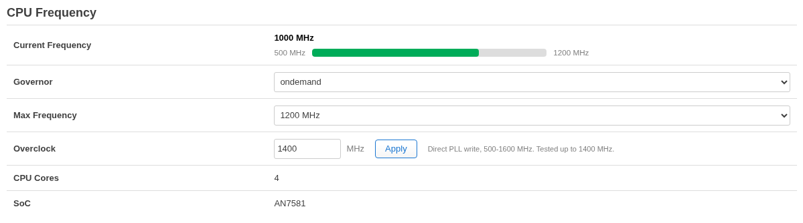
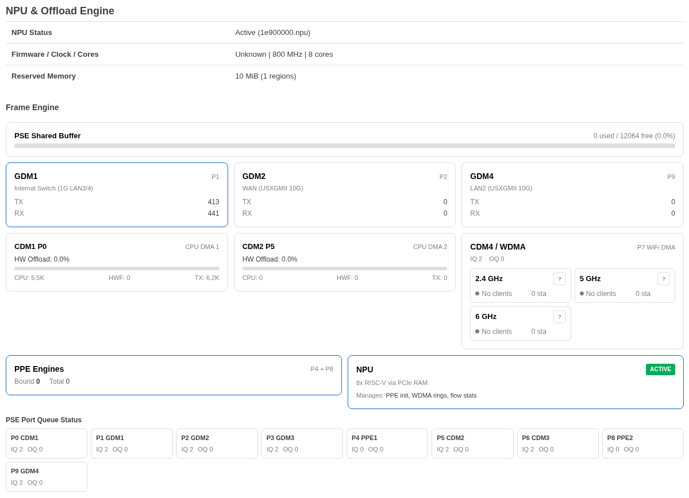

# luci-app-airoha-npu

Real-time monitoring and management dashboard for the Airoha AN7581 and AN7583 SoCs on OpenWrt. Covers NPU offload, CPU frequency, WiFi band health, Frame Engine internals, and PPE flow tables.

A fork of [rchen14b/luci-app-airoha-npu](https://github.com/rchen14b/luci-app-airoha-npu) with AN7583 support and a pass over the LuCI packaging.

## Screenshots

### CPU Frequency & Overclock


### NPU & Offload Engine


## Features

### CPU Frequency Management
- Current frequency display with visual bar graph
- Governor selection (performance, ondemand, schedutil, etc.)
- Max frequency selection from available OPP entries
- Direct PLL overclock control (500-1600 MHz by default; the ceiling is `AIROHA_OC_MAX_MHZ` in the rpcd backend, and the page reads it rather than keeping its own copy) with hardware register programming
- Overclock detection and warning for unstable frequencies

### NPU & Offload Engine
- NPU firmware version (TLB format), clock frequency, core count
- NPU load status (active/inactive) and reserved memory regions
- WiFi token pool health indicator with in-flight count
- PPE flow offload summary (bound / total entries)
- Per-band WiFi status cards (2.4 GHz, 5 GHz, 6 GHz):
  - Client count and link health indicator (Good / Fair / Poor)
  - NPU vs DMA path badge
  - TX retry rate percentage with color-coded thresholds

### Frame Engine Visualization
- **PSE Shared Buffer** usage bar (congestion indicator)
- **GDM port cards** with live TX/RX packet counters and drop counts:
  - GDM1: Internal Switch (1G LAN3/4)
  - GDM2: WAN (USXGMII 10G)
  - GDM4: LAN2 (USXGMII 10G)
- **CDM offload ratio** bars — HW-forwarded (PPE) vs CPU-path packets
- **PSE Port Queue Status** grid (P0-P9) with IQ/OQ queue depths and drop counts

### PPE Flow Offload Table
- First 100 PPE entries with state (BND/UNB), type (IPv4/IPv6/L2B), 5-tuple, and MAC addresses
- Auto-refreshes every 5 seconds

### Theme Support
- Colors come from the custom properties LuCI themes export (`--background-color-*`, `--text-color-*`, `--primary/success/warn/error-color-*`), each with a literal fallback
- Light and dark mode, and any palette or tint variant a theme offers, are handled by the theme rather than detected here
- The stylesheet lives inside the view and every class and id is prefixed `airoha-npu-`, so it neither outlives the page nor collides with another app

## Requirements

- OpenWrt with LuCI (24.10+)
- Airoha target (`@TARGET_airoha`); the overclock control needs AN7581 or AN7583, which it detects from the device tree, and refuses to write anything on an unrecognised SoC
- Optional: register access for the Frame Engine section and the CPU overclock, which needs two things a default build does not have: the busybox `devmem` applet (`CONFIG_BUSYBOX_CONFIG_DEVMEM=y`) and a kernel with `/dev/mem` (`CONFIG_KERNEL_DEVMEM=y`). Both are build-time options, so installing the package alone does not enable those two parts
- Optional: PPE debugfs (`/sys/kernel/debug/ppe/entries`) for the flow offload table
- Optional: WiFi token_info debugfs for per-band WiFi stats (`/sys/kernel/debug/ieee80211/phy0/mt76/token_info`)
- Optional: [air_tools](https://github.com/merbanan/air_tools) scripts for additional Frame Engine debugging

A missing source costs its own section; the rest of the page still renders.

## Installation

### From OpenWrt build

The LuCI feed has to be installed first: the package build includes
`feeds/luci/luci.mk`.

```sh
# Add to your build tree
git clone https://github.com/VitaliySochniy/luci-app-airoha-npu.git package/luci-app-airoha-npu

# Enable in menuconfig
make menuconfig
# Navigate to: LuCI -> Applications -> luci-app-airoha-npu

# Build
make package/luci-app-airoha-npu/compile V=s
```

It can also be kept out of the build tree as its own feed, which keeps it
out of images that do not ask for it:

```sh
# clone anywhere, then point a feed at the directory holding the clone
git clone https://github.com/VitaliySochniy/luci-app-airoha-npu.git ~/openwrt-feeds/luci-app-airoha-npu
echo "src-link airoha $HOME/openwrt-feeds" >> feeds.conf

./scripts/feeds update airoha
./scripts/feeds install luci-app-airoha-npu
```

### Manual install (dev)

```sh
# Copy files to router
scp root/usr/libexec/rpcd/luci.airoha_npu root@router:/usr/libexec/rpcd/
scp root/usr/share/luci/menu.d/luci-app-airoha-npu.json root@router:/usr/share/luci/menu.d/
scp root/usr/share/rpcd/acl.d/luci-app-airoha-npu.json root@router:/usr/share/rpcd/acl.d/
scp htdocs/luci-static/resources/view/airoha_npu/status.js root@router:/www/luci-static/resources/view/airoha_npu/

# Set permissions and restart
ssh root@router 'chmod +x /usr/libexec/rpcd/luci.airoha_npu && /etc/init.d/rpcd restart'
```

## Data Sources

| Data | Source | Required |
|------|--------|----------|
| NPU status | `/sys/bus/platform/drivers/airoha-npu/`, `dmesg` | Yes |
| CPU frequency | `/sys/devices/system/cpu/cpufreq/policy0/` | Yes |
| Overclock PLL | `devmem` registers, per SoC: AN7581 0x1fa202b4/0x1fa202b8, AN7583 0x1fa202ac/0x1fa202b0/0x1fa202b8 | devmem |
| PPE entries | `/sys/kernel/debug/ppe/{entries,bind}` | Optional |
| WiFi token pool | `/sys/kernel/debug/ieee80211/phy0/mt76/token_info` | Optional |
| WiFi station stats | `iw dev <iface> station dump` | Optional |
| Frame Engine (GDM/CDM/PSE) | `devmem` registers (0x1fb50xxx-0x1fb53xxx) | devmem |

## Project Structure

```
luci-app-airoha-npu/
├── Makefile                                          # OpenWrt package build
├── htdocs/
│   └── luci-static/resources/view/airoha_npu/
│       └── status.js                                 # LuCI JavaScript view
├── root/
│   └── usr/
│       ├── libexec/rpcd/
│       │   └── luci.airoha_npu                       # RPC backend (shell)
│       └── share/
│           ├── luci/menu.d/
│           │   └── luci-app-airoha-npu.json          # Menu config
│           └── rpcd/acl.d/
│               └── luci-app-airoha-npu.json          # ACL permissions
└── screenshots/
```

## RPC Methods

| Method | Description | Parameters |
|--------|-------------|------------|
| `getStatus` | NPU, CPU, PPE summary | — |
| `getPpeEntries` | PPE flow table (first 100) | — |
| `getTokenInfo` | WiFi token pool & station stats | — |
| `getFrameEngine` | PSE/GDM/CDM register counters | — |
| `setGovernor` | Change CPU governor | `governor` |
| `setMaxFreq` | Set CPU max frequency | `freq` (kHz) |
| `setOverclock` | Direct PLL frequency set | `freq_mhz` |

## License

Apache-2.0

## Credits

Written by Ryan Chen for the W1700K router (Airoha AN7581 + MT7996 BE19000). This fork adds AN7583 support and reworks the LuCI side; see the git log.
